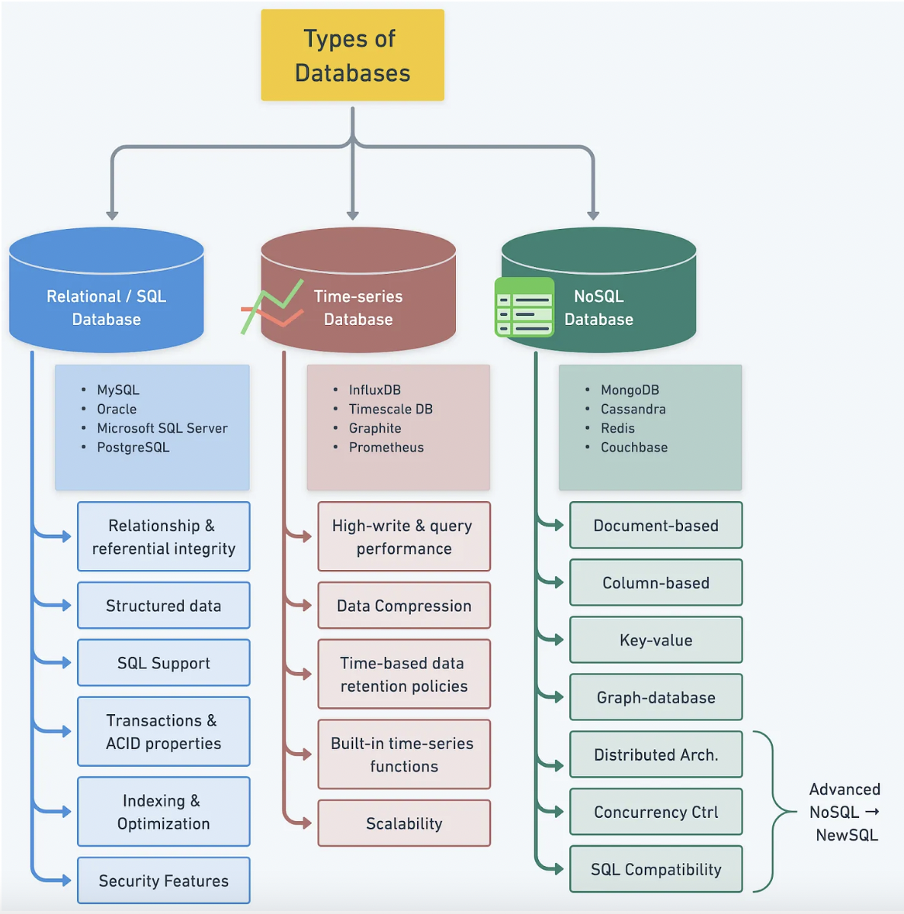
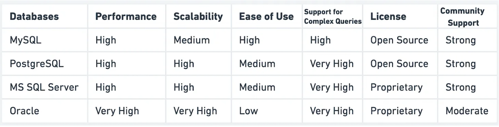

## Database Selection

> The success of a software application often hinges on the choice of the right databases. 
<small>Alex Xu. 2023. Understanding Database Types</small>

Learning objectives: the art of database selection

The process of database selection is guided by
- Database types (Relational, noSQL, Time-series, NewSQL)
- Various factors influenicng selection
   - Cost, security, performance, scalability, data model

### Understanding Database Types
Database management systems are ranked according to their popularity.

#### Relational Databases
>Relational database organizes data into tables with rows and columns.

This database is the standard choice for many applications.

**Structured data organization**
 - stored in tables with a predefined schema
 - easier to manage and maintain data, even large amounts
**SQL support**
 - Structured Query Language (SQL) - widely adopted

 <small>Source: Alex Xu. 2023. Understanding Database Types.</small>