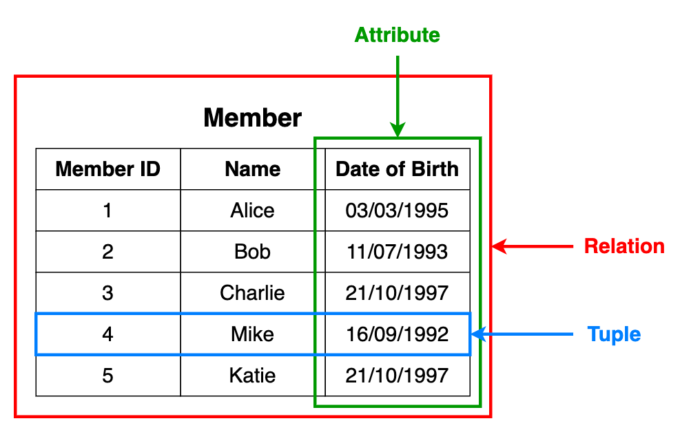
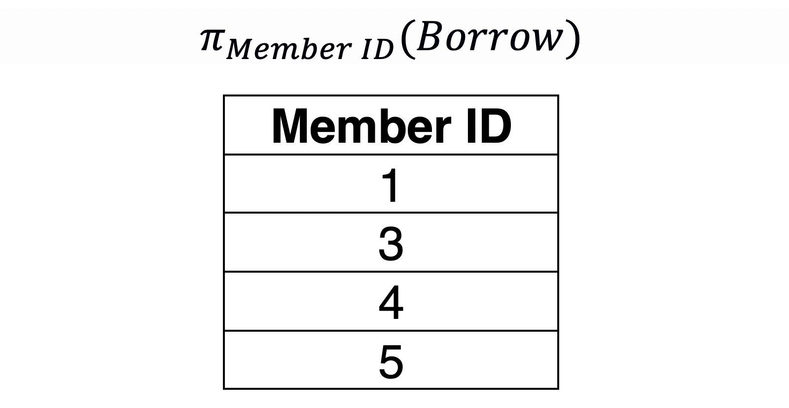
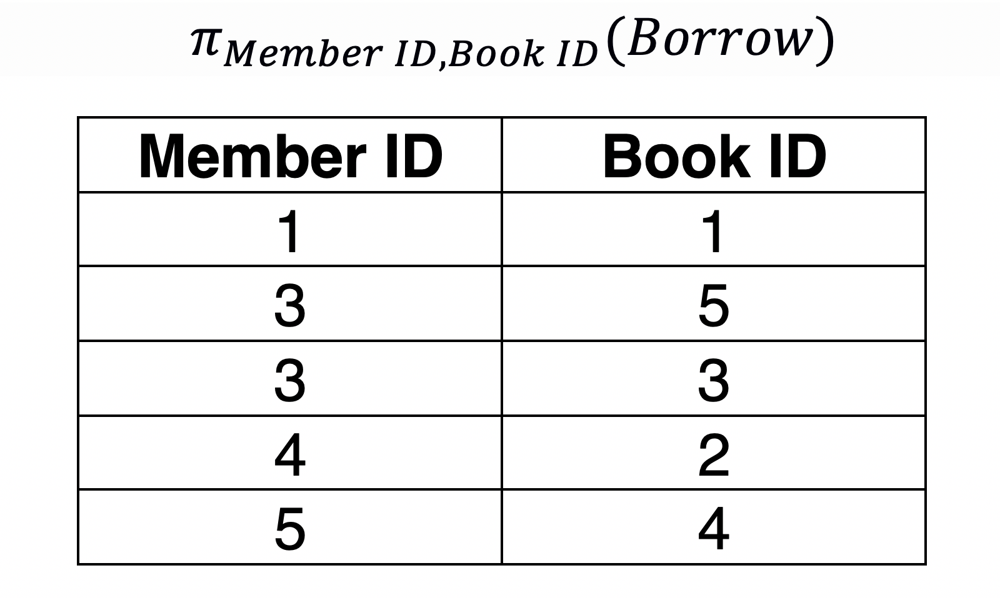
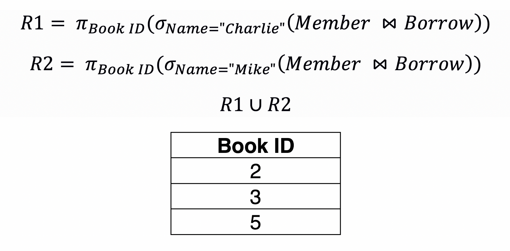

## Join Types

<small>Source: https://www.geeksforgeeks.org/difference-between-natural-join-and-inner-join-in-sql/ </small>

### Natural Join

> Natural Join joins two tables based on same attribute name and datatypes. The resulting table will contain all the attributes of both the table but keep only one copy of each common column. 




### Operators

#### Projection
Projection is used to select the required columns of data from a relation. Note that projection removes duplicate data (tuples).

> Query: Member IDs of members who have borrowed books.
```
SELECT DISTINCT member_id FROM borrow;
```


> Query: Member IDs of members and the Book IDs of the books they have borrowed books.

```
SELECT DISTINCT member_id,book_id FROM borrow;
```


#### Selection

Selection is used to select the required tuples of data from a relation. During selection, we can specify certain conditions that the data must satisfy.

> Query: Rename the Member relation as LibraryMember

```
SELECT DISTINCT member_id,book_id FROM borrow;
```


#### Rename

RENAME - altering the attribute name of the resultant relation or to give a specific name to the resultant relation.
- Remove confusion if two or more relations have attributes with the same name
- Provide user-friendly names for attributes, especially when interfacing with reporting engines
- Provide a convenient way to change the relation definition and still be backward compatible

In SQL we would translate the RENAME operator using the SQL ‘AS’ statement:
```
SELECT dob AS ‘Birth_Date’, empno AS ‘Employee_Number’ FROM EMPLOYEE
```

#### Cross Product


Cross product - combining data from two different relations into one relation. If we consider two relations; A with n tuples and B with m tuples, A ✕ B will consist of n.m tuples.

> Query: Member ✕ Borrow

```
SELECT * FROM member,borrow;
```

#### Union

Union is very similar to that of set theory. Both the relations must have the same set of attributes.

> Query: Book IDs of the books borrowed by Charlie and Mike.
```
SELECT book_id FROM member natural join borrow where name='Charlie' UNION
SELECT book_id FROM member natural join borrow where name='Mike';
```


#### Intersect


> Query: Member IDs of the members who have borrowed both the books “Fences” and “Inheritance”.

```
SELECT borrow.member_id FROM borrow 
JOIN book ON book.book_id = borrow.book_id 
WHERE name IN ('Fences','Inheritance')
GROUP BY member_id;
```

#### Natural Join

Natural join between two or more relations will result in all the combination of tuples where they have equal values for the common attribute.
```
SELECT * FROM member NATURAL JOIN borrow;
```
