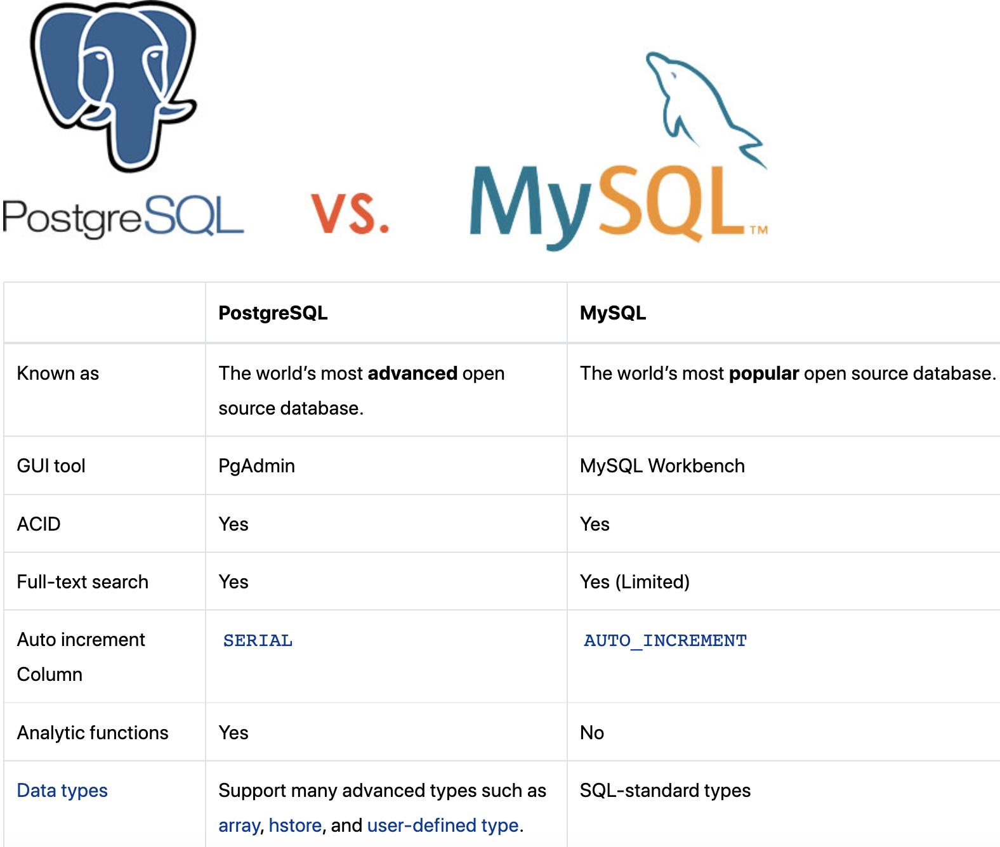
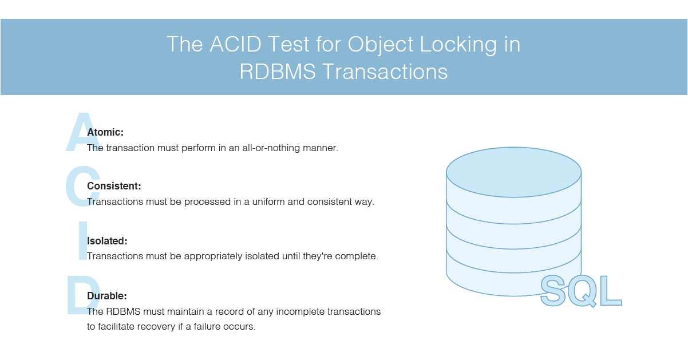

## PostgreSQL and MySQL

### Relational DBMS

- Relational database management systems (RDBMS) support **the relational (=table-oriented) data model** 
- **The relation schema** (schema of a table) is defined by the table name and a fixed number of attributes with fixed data types 
- **A record (entity)** = a row in the table and consists of the values of each attribute 
- **A relation**  =  a set of uniform records


<small>Source: https://db-engines.com/en/ranking</small>

MySQL and PostgreSQL are the top two open source relational databases. 

```{note}
MySQL has been famous for its ease of use and speed, while PostgreSQL has many more advanced features, which is the reason that PostgreSQL is often described as an open-source version of Oracle (Source: https://www.postgresqltutorial.com/postgresql-vs-mysql/)
```


For more information, see [https://www.postgresqltutorial.com/postgresql-vs-mysql/](https://www.postgresqltutorial.com/postgresql-vs-mysql/)



<small>Source: https://www.dnsstuff.com/database-locking#the-acid-test</small>


#### Architecture
<small>Source: https://www.fivetran.com/blog/postgresql-vs-mysql</small>
- PostgreSQL is an object-relational database, while MySQL is purely relational:
    - PostgreSQL offers more complex data types and allows objects to inherit properties, but it also makes working with PostgreSQL more complex

- Three common database features are views, triggers, and stored procedures:
    - PostgreSQL has more robust views, and supports materialized views, which can improve performance for complex queries
    
#### Data Types
- Postgres offers a wider variety of data types than MySQL:
   - For basic character and numeric data types, both databases will suit your choice   

#### PostgreSQL vs. MySQL
<small>Source: https://www.fivetran.com/blog/postgresql-vs-mysql</small>

> If you are developing an application with a database back end, which of the two should you use? 

- Consider PostgreSQL:
  - for any application that might grow to enterprise scope, with complex queries and frequent write operations
  
  
- Consider MySQL:
   - If you do not expect your application to scale up
   - If you are looking for a quick tool for prototyping
   - MySQL is more widely used than PostgreSQL, more developers and DBAs are familiar with it, and more third-party tools are available for it
   
```{note}
- The most common application of MySQL is in data storage for web services, which makes MySQL the basis of many dynamic web presences such as YouTube, Facebook and Twitter. 

-  The number of companies implementing projects with PostgreSQL is growing. Innovative companies such as Apple, Netflix or Spotify are just some of the best-known users of PostgreSQL.

```

### Summary

- Generally, MySQL is typically recommended for web-based/online or mapping functions
- PostgreSQL is recommended for large analytical processes
- MySQL is rather lightweight and reliable
- PostgreSQL is super extensible and very feature rich

<small>https://kruschecompany.com/postgresql-vs-mysql/</small>

### Postgres Practice

- Practical Textbook
   - Install PostgreSQL with pgAdmin

- Interactive Online Practice
   - No installation
   - Link: [https://pgexercises.com/questions/basic/](https://pgexercises.com/questions/basic/)