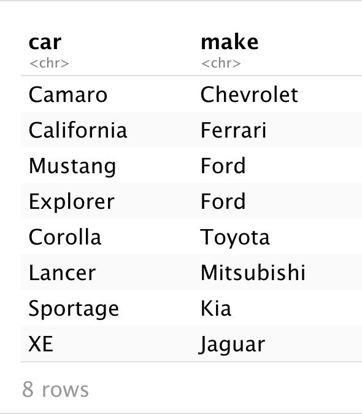
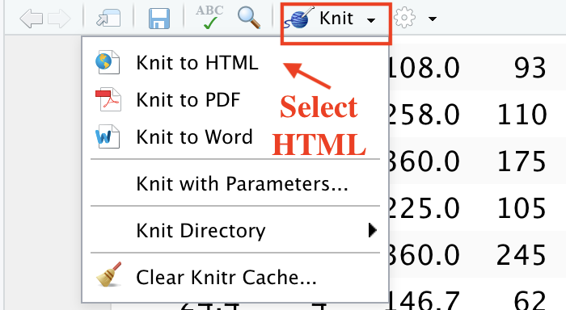

## SQLite in R
<small>
Source: [SQLite](https://db.rstudio.com/databases/sqlite/)
Source: [DBI](https://dbi.r-dbi.org/)
Source: [SQLITE in R](https://www.datacamp.com/community/tutorials/sqlite-in-r)
</small>

See Rmarkdown in Canvas for code.

Open RStudio: File > Open File > select rsqlite.rmd


Uncomment two lines to install necessary libraries.

```
install.packages("RSQLite")
install.packages("DBI")
```

```{note}
The DBI package helps connecting R to database management systems (DBMS). DBI separates the connectivity to the DBMS into a “front-end” and a “back-end”.
```

You can run cell separately like you woulld do in python notebook


### Creating Connection and Database


Our database will be called CarsDB.db

```{r}
conn <- dbConnect(RSQLite::SQLite(), dbname = "CarsDB.db")
```
Recall in python you connect as follows: ```connection = sqlite3.connect('mydatabase.db')``` 
 
### Prepare data
Load the mtcars as an R data frame put the row names as a column, and print the header.

```
data("mtcars")
mtcars$car_names <- rownames(mtcars)
rownames(mtcars) <- c()
head(mtcars) 
 ```

### Load data table to database

We are using the ```dbWriteTable()``` function:

- **conn**: The connection to your SQLite database
- **name**: The name you want to use for your table
- **value**: The data that you want to insert. It should be an R data frame.

```dbWriteTable()``` - list of tables available in database

```
dbWriteTable(conn, "cars_data", mtcars)
dbListTables(conn)
```

### Add and apend tables
We can add another table "Cars_and_Makes".

We can also append several dataframes to a table using ```append=TRUE```.

Here we ar egoing to create two small dataframes and combine them in a List (dfList), then we will create a table "Cars_and_Makes" where we will append all dataframes from the list to one table using foor loop.
```
# Create toy data frames
car <- c('Camaro', 'California', 'Mustang', 'Explorer')
make <- c('Chevrolet','Ferrari','Ford','Ford')
df1 <- data.frame(car,make)
car <- c('Corolla', 'Lancer', 'Sportage', 'XE')
make <- c('Toyota','Mitsubishi','Kia','Jaguar')
df2 <- data.frame(car,make)
# Add them to a list
dfList <- list(df1,df2)
# Write a table by appending the data frames inside the list
for(k in 1:length(dfList)){
    dbWriteTable(conn,"Cars_and_Makes", dfList[[k]], append = TRUE)
}
# List all the Tables
dbListTables(conn)
dbWriteTable(conn,"Cars_and_Makes", dfList[[k]], append = TRUE)
```

Now  we have two tables in database: Cars_and_Makes and cars_data

#### Querying

We use ```dbGetQuery``` to create queries:

- **conn**: The connection to the SQLite Database
- **query**: The SQL query you want to execute as a string

**Query 1**. Gather data from a table
```
dbGetQuery(conn, "SELECT * FROM Cars_and_Makes")
```


```{note}
through RSQLIte, you can execute any query that is valid for a SQLite database (Except RIGHT OUTER JOINS and FULL OUTER JOINS, which are not allowed in SQLite).
```
Recall in python you create cursor ```cursor = connection.cursor()```, then execute ```cursor.execute("SELECT * FROM emp")```


**Query 2**. Gather the first 10 rows in the cars_data table

```
dbGetQuery(conn, "SELECT * FROM cars_data LIMIT 10")
```

**Query 3**. Get the car names and horsepower of the cars with 8 cylinders

```
dbGetQuery(conn,"SELECT car_names, hp, cyl FROM cars_data
                 WHERE cyl = 8")
```

**Query 4**. Get the car names and horsepower starting with M that have 6 or 8 cylinders
```
dbGetQuery(conn,"SELECT car_names, hp, cyl FROM cars_data
                 WHERE car_names LIKE 'M%' AND cyl IN (6,8)")
```

**Query 5**. Get the average horsepower and mpg by number of cylinder groups
```
dbGetQuery(conn,"SELECT cyl, AVG(hp) AS 'average_hp', AVG(mpg) AS 'average_mpg' FROM cars_data
                 GROUP BY cyl
                 ORDER BY average_hp")
```

#### Storing

Store the results of your queries as a data frame by assigning the result of your query to a variable.

```
avg_HpCyl <- dbGetQuery(conn,"SELECT cyl, AVG(hp) AS 'average_hp'FROM cars_data
                 GROUP BY cyl
                 ORDER BY average_hp")
avg_HpCyl
class(avg_HpCyl)
```
#### Parametrization

- One of the greatest advantages of operating with SQLite databases from R is the ability to use **parameterized queries**. That is, using variables available in your R workspace and adding them to query your SQLite database.

- An example of the power of the intersection between R and SQLite can be seen in parameterized queries, which could be used if you need to query a database in order to display information based on user input inside an R Shiny app. Another example use case or parameterized queries could be virtual assistants or chatbots. 


> For example, there is some user input (e.g. from the dynamic webapp) that asks us to look only into cars that have over 18 miles per gallon (mpg):

```
mpg <-  18
cyl <- 6
Result <- dbGetQuery(conn, 'SELECT car_names, mpg, cyl FROM cars_data WHERE mpg >= ? AND cyl >= ?', params = c(mpg,cyl))
Result
```

- The placeholder value in the query (>= ?) and the params argument of dbGetQuery(), which takes a list or a vector with the values for the placeholders (in this case we have a vector containing the mpg and cyl variables).

#### Insert / Delete

the function ```dbExecute()```is used for inserting, updating or deleting table records. 

```
# Insert the data for the Mazda RX4. This will also ouput a 1
dbExecute(conn, "INSERT INTO cars_data VALUES (21.0,6,160.0,110,3.90,2.620,16.46,0,1,4,4,'Mazda RX4')")
# See that we re-introduced the Mazda RX4 succesfully at the end
dbGetQuery(conn, "SELECT * FROM cars_data")
```

```
# Delete the column belonging to the Mazda RX4. You will see a 1 as the output.
dbExecute(conn, "DELETE FROM cars_data WHERE car_names = 'Mazda RX4'")
```

#### Disconnect

```
dbDisconnect(conn)
```

#### Knit your Notebook

Once you are done and all your query chunks work properly, you can convert yoru notebook too HTML for sharing.

```{note}
Because you have created a real database (it is in yoru directory) and inserted tables [if you ran your code chunks one by one] - you do not want to run those lines again - it will cause an error. Add eval=FALSE in step 3 and step 4 (inside curly brackets)

{r eval=FALSE}

```

